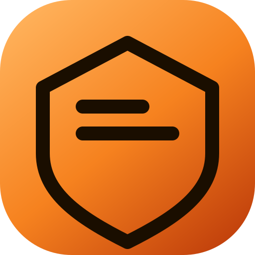

<p align="center">
    
    <h1 align="center">Skymail Oneclick</h1>
    <p align="center">One-click deploy Cloud Mail / Skymail domain email to Cloudflare, including Email Routing catch-all 🎉</p>
    <p align="center">
        <a href="./README.md">简体中文</a> | English
    </p>
    <p align="center">
        <a href="https://github.com/zuodazuoqiang001/skymail-oneclick/issues"></a>
        <a href="https://github.com/zuodazuoqiang001/skymail-oneclick"></a>
        <a href="https://github.com/zuodazuoqiang001/skymail-oneclick"></a>
        <a href="https://github.com/zuodazuoqiang001/skymail-oneclick/blob/main/LICENSE"></a>
        <a href="https://github.com/zuodazuoqiang001/skymail-oneclick/releases"></a>
    </p>
</p>

The three official methods (GitHub Action, Cloudflare dashboard, Wrangler CLI) can all publish the Worker, but **Email Routing, catch-all to the Worker, MX, D1/KV/R2, custom domains, and `/api/init`** still require clicking around the dashboard. Those account operations all have APIs, so this tool chains them into a one-click pipeline with **a single Token**.

The Token is only sent to `api.cloudflare.com` and local `wrangler deploy`. It is never uploaded to a third party.

## What you need first

1. **Node.js 22+** (required by Wrangler 4.87+. If older, the wizard downloads a portable Node 22)
2. A domain already on Cloudflare (nameservers switched)
3. A Cloudflare **User API Token** (My Profile → API Tokens). Do not use an Account API Token (`cfat_` prefix). This wizard also does not support the Global API Key.

Cloudflare **has no “all permissions” custom token**. The fastest way is the official prefilled link (permissions already checked, Account=*, Zone=all):

In step 1 of the wizard, click **Prefill required permissions**, or open [Cloudflare: auto-create the Skymail deploy token](https://dash.cloudflare.com/profile/api-tokens?permissionGroupKeys=%5B%7B%22key%22%3A%22workers_scripts%22%2C%22type%22%3A%22edit%22%7D%2C%7B%22key%22%3A%22workers_kv_storage%22%2C%22type%22%3A%22edit%22%7D%2C%7B%22key%22%3A%22d1%22%2C%22type%22%3A%22edit%22%7D%2C%7B%22key%22%3A%22workers_r2%22%2C%22type%22%3A%22edit%22%7D%2C%7B%22key%22%3A%22account_settings%22%2C%22type%22%3A%22read%22%7D%2C%7B%22key%22%3A%22email_routing_addresses%22%2C%22type%22%3A%22edit%22%7D%2C%7B%22key%22%3A%22zone%22%2C%22type%22%3A%22read%22%7D%2C%7B%22key%22%3A%22dns%22%2C%22type%22%3A%22edit%22%7D%2C%7B%22key%22%3A%22workers_routes%22%2C%22type%22%3A%22edit%22%7D%2C%7B%22key%22%3A%22email_routing_rules%22%2C%22type%22%3A%22edit%22%7D%2C%7B%22key%22%3A%22email_routing_settings%22%2C%22type%22%3A%22edit%22%7D%2C%7B%22key%22%3A%22ssl_and_certificates%22%2C%22type%22%3A%22edit%22%7D%2C%7B%22key%22%3A%22zone_settings%22%2C%22type%22%3A%22edit%22%7D%5D&accountId=*&zoneId=all&name=Skymail%20Oneclick).

If the dropdowns look empty after opening it, click **Continue to summary** → **Create Token**. That is a Cloudflare dashboard rendering bug; the permissions are complete on the summary page.

Required permissions:

**Account**
- Workers Scripts: Edit
- Workers KV Storage: Edit
- D1: Edit
- Workers R2 Storage: Edit
- Account Settings: Read
- Email Routing Addresses: Edit

**Zone** (include the domain that will receive mail)
- Zone: Read
- DNS: Edit
- Workers Routes: Edit
- Email Routing Settings: Edit
- Email Routing Rules: Edit
- SSL and Certificates: Edit
- Zone Settings: Edit

Alternative: start from the **Edit Cloudflare Workers** template, then add Email Routing / DNS / SSL by hand.

A **Free** plan is enough. Email Routing goes to a Worker catch-all, so you do not need to verify a forwarding mailbox.

## Fastest way to create a Token

Cloudflare **has no select-all permission**. Do not click through Create Custom Token one by one.

### Method A: F12 script (recommended)

1. Sign in to the [Cloudflare dashboard](https://dash.cloudflare.com/)
2. Copy the **F12 script** from this wizard (`web/assets/cf-token-console.js`)
3. On a **dash.cloudflare.com** page, press F12 → Console → paste and Enter
4. On success the Token is copied to the clipboard; return to the wizard to verify

The script uses your current dashboard session to call `/api/v4/user/tokens`. It only creates the User API Token this project needs, and does not upload it anywhere.

### Method B: Official prefilled link

Open [Cloudflare: auto-create the Skymail deploy token](https://dash.cloudflare.com/profile/api-tokens?permissionGroupKeys=%5B%7B%22key%22%3A%22workers_scripts%22%2C%22type%22%3A%22edit%22%7D%2C%7B%22key%22%3A%22workers_kv_storage%22%2C%22type%22%3A%22edit%22%7D%2C%7B%22key%22%3A%22d1%22%2C%22type%22%3A%22edit%22%7D%2C%7B%22key%22%3A%22workers_r2%22%2C%22type%22%3A%22edit%22%7D%2C%7B%22key%22%3A%22account_settings%22%2C%22type%22%3A%22read%22%7D%2C%7B%22key%22%3A%22email_routing_addresses%22%2C%22type%22%3A%22edit%22%7D%2C%7B%22key%22%3A%22zone%22%2C%22type%22%3A%22read%22%7D%2C%7B%22key%22%3A%22dns%22%2C%22type%22%3A%22edit%22%7D%2C%7B%22key%22%3A%22workers_routes%22%2C%22type%22%3A%22edit%22%7D%2C%7B%22key%22%3A%22email_routing_rules%22%2C%22type%22%3A%22edit%22%7D%2C%7B%22key%22%3A%22email_routing_settings%22%2C%22type%22%3A%22edit%22%7D%2C%7B%22key%22%3A%22ssl_and_certificates%22%2C%22type%22%3A%22edit%22%7D%2C%7B%22key%22%3A%22zone_settings%22%2C%22type%22%3A%22edit%22%7D%5D&accountId=*&zoneId=all&name=Skymail%20Oneclick). Empty dropdowns are fine — Continue to summary → Create Token.

The only true “full permission” credential is the **Global API Key** (email + `X-Auth-Key`). It is high risk, and this wizard does not use it.

## Install

Windows / macOS / Linux (Node.js 22+; a portable Node 22 is downloaded if missing or too old):

```bash
git clone https://github.com/zuodazuoqiang001/skymail-oneclick.git
cd skymail-oneclick
```

## Start the wizard

In this directory:

```bat
deploy.cmd
```

or:

```powershell
.\deploy.ps1
```

or:

```bash
node deploy.mjs
# or ./deploy.sh
```

Open `http://127.0.0.1:8788` in a browser:

1. Paste the Token, verify the account and domains
2. Select the mail domain, fill in the site hostname (default `mail.example.com`) and admin email
3. If the domain previously received mail via Google / a company mail provider, you must check **Replace existing MX**, otherwise MX records are left unchanged
4. Click one-click deploy and wait for Worker build/publish, Email Routing catch-all, and database init

When it finishes, **register the first account on the site using the admin email**.

Step 2 of the wizard has **Purge a deployed mailbox**: enter the site / mail domain / Worker name, preview, then type `清空` to confirm. By default this deletes the Worker, D1, KV, and custom domains, and turns off catch-all. MX removal is a separate checkbox.

## CLI

```bash
node deploy.mjs --cli --token <CF_TOKEN> --zone example.com --site mail.example.com --admin admin@example.com --replace-mx
```

With multiple accounts, add `--account <ACCOUNT_ID>`. Multiple mail domains: `--zone a.com,b.com`. Skip R2: `--no-r2`.

## What the pipeline does

1. Check Token permissions
2. Create or reuse D1 `cloud-mail`, KV `cloud-mail-kv`, R2 `cloud-mail-r2`
3. Pull the latest [maillab/cloud-mail](https://github.com/maillab/cloud-mail) from GitHub (mirrors / zip if GitHub is blocked)
4. Generate `wrangler.toml` (domain list, admin, jwt_secret, custom domain)
5. Ensure Node 22+ (auto-upgrade/download if needed), auto-install pnpm and `mail-worker` / `mail-vue` dependencies, then build the Vue frontend and `wrangler deploy`
6. Bind the custom domain
7. Enable Email Routing, with catch-all pointing at the Worker
8. Hit `/api/init/{jwt}` to initialize the database

State is written to `.skymail-state.json` (no Token, but it contains the jwt — keep it private).

## Differences from the official docs

| Step | Official | Here |
| --- | --- | --- |
| D1 / KV / R2 | Dashboard or Action Secrets, IDs filled by hand | API create/reuse |
| Worker + frontend | Action / dashboard / wrangler | Auto clone + deploy |
| Custom domain | Manual bind | wrangler routes + API |
| Email Routing / MX / catch-all | **Must click by hand** | API |
| Database init | Open `/api/init/secret` in a browser | Called after deploy |

This project still uses the official source. It does not maintain a fork. After Cloud Mail upgrades, run the wizard again (same-named resources are reused).

## Notes

- The site defaults to `mail.your-domain` so it does not take over the apex homepage. If you want `example.com` itself as the mailbox site, set the site hostname to the apex.
- **Replacing MX means that domain will no longer receive mail at the previous provider.**
- If auto init fails because the certificate is not ready yet, wait 1–2 minutes and open: `https://your-site/api/init/your-jwt`
- If login CAPTCHA (Turnstile) is not configured, leave the site key empty in the admin panel or fill in your own Turnstile keys.
- This machine needs access to GitHub and the Cloudflare API. If git is missing, a zip download is used instead.

## Docs

- Skymail docs: https://doc.skymail.ink/
- Upstream repo: https://github.com/maillab/cloud-mail

## License

This repository is MIT. At deploy time it clones the latest upstream [maillab/cloud-mail](https://github.com/maillab/cloud-mail) (MIT). This project does not vendor or fork that source.
